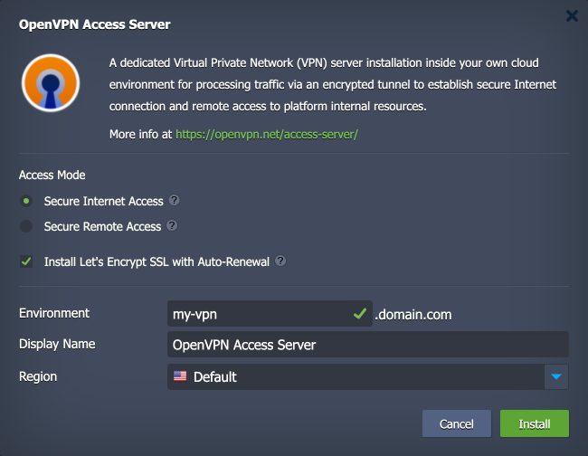
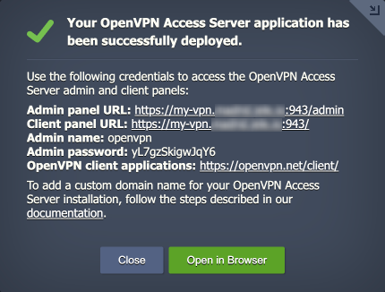
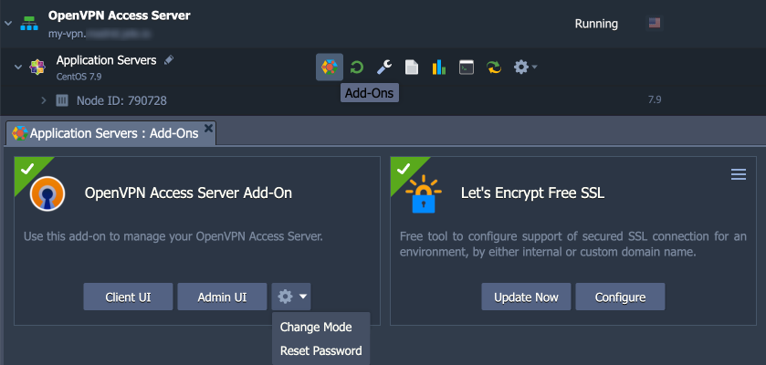
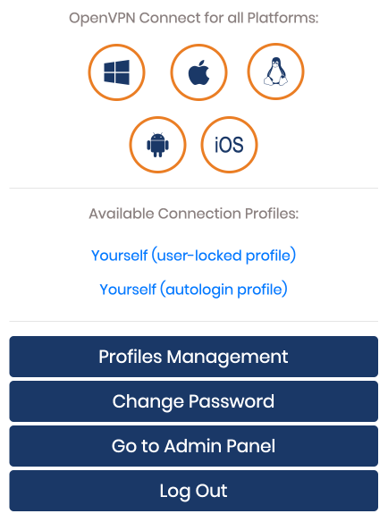
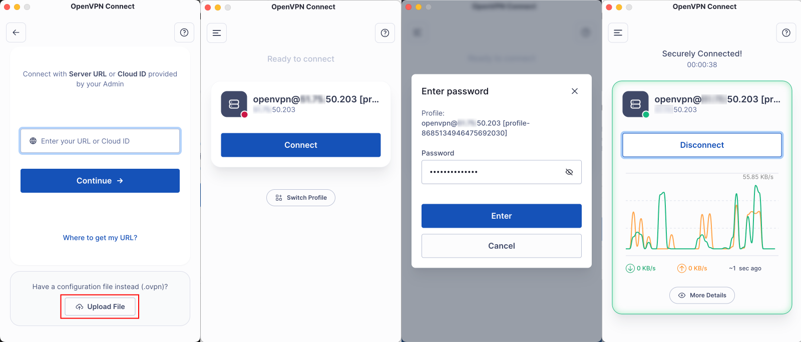

 

# OpenVPN Access Server with Let’s Encrypt SSL

The package deploys **[OpenVPN Access Server](https://openvpn.net/access-server/)**, a remote-access VPN server based on the popular OpenVPN open-source software. It allows you to work with a configured VPN server using cross-platform client software. The built-in web administration panel allows you to set up all possible OpenVPN configurations. The package provides an option to complement installation with a free, auto-renewable Let’s Encrypt SSL certificate.

## Deployment to Cloud

To get your OpenVPN Access Server solution, click the "**Deploy to Cloud**" button below, specify your email address within the widget, choose one of the [Virtuozzo Public Cloud Providers](https://www.virtuozzo.com/application-platform-partners/), and confirm by clicking **Install**.

> If you already have a Virtuozzo Application Platform (VAP) account, you can deploy this solution from the [Marketplace](https://www.virtuozzo.com/application-platform-docs/marketplace/) or [import](https://www.virtuozzo.com/application-platform-docs/environment-import/) a manifest file from this repository.

## Installation Process

In the opened installation window at the VAP dashboard, you can set up the following parameters:

- Access Mode:
  - **Secure Internet Access** - provides safer general Internet use by utilizing encrypted tunneling
    - *How it works:* all your traffic is encrypted and routed through the VPN server before it goes out to the public Internet
    - *Goal:* to protect your data from potential threats when using untrusted networks (e.g., public Wi-Fi hotspots)
    - *DNS:* public (Google) DNS server
  - **Secure Remote Access** - provides a secure access point to your private network within the Virtuozzo Application Platform
    - *How it works:* all your traffic is encrypted and routed through the VPN server before it goes to your private resources in the same [cloud region](https://www.virtuozzo.com/application-platform-docs/choosing-region/) or [isolated environment group](https://www.virtuozzo.com/application-platform-docs/environment-isolation/) as the OpenVPN Access Server
    - *Goal:* to securely access your cloud resources from any location
    - *DNS:* platform's internal DNS server (so private environment and container hostnames work)
- **Install Let's Encrypt SSL with Auto-Renewal** - enables automatic installation of a free, auto-renewable SSL certificate for your OpenVPN Access Server.

> By default, the platform issues a [built-in SSL](https://www.virtuozzo.com/application-platform-docs/built-in-ssl/) certificate for your application that is valid for the platform domain. However, if you plan to use a custom domain name, tick the [Let's Encrypt SSL](https://www.virtuozzo.com/company/blog/free-ssl-certificates-with-lets-encrypt/) option to attach a public IP and get a free, trusted SSL certificate.

Next, provide a preferred environment and display names, choose a region (if available), and confirm the installation.

## OpenVPN Management

After the installation is complete, you'll receive an email with links and generated credentials for the **admin** and **client** panels. Additionally, you can find this information in the installation success notification at the VAP dashboard.

Use the **Admin UI** to manage the OpenVPN server settings, user permissions, and other configurations. By default, the solution provides a free OpenVPN Access Server license for **two** concurrent connections.

Use the **Client UI** to download the OpenVPN profiles required for connecting to the VPN server.

For additional management options, you can also access **Add-Ons** for your OpenVPN Access Server environment at the VAP dashboard. Here, you can find the following add-ons:

- **OpenVPN Access Server Add-On** - allows you to access the *Admin UI* and *Client UI* panels, *change the access mode* (Secure Internet Access or Secure Remote Access) of your VPN solution, and *reset the admin password* if needed.
- **Let’s Encrypt SSL Add-On** - enables you to configure a *[custom domain](https://www.virtuozzo.com/application-platform-docs/custom-domains/)* for your OpenVPN Access Server. Click **Configure** and specify a custom domain name that should be bound to the public IP of your node at your domain registrar.

## Connect to OpenVPN Server

1\. Download the OpenVPN profile from the **Client UI** panel using the credentials provided after the installation.

2\. Download and install the **[OpenVPN client](https://openvpn.net/client/)** software on your device.

3\. Use the **Upload File** option to import the downloaded OpenVPN profile into the OpenVPN client application.

4\. Click **Connect** for the VPN server from the uploaded profile and provide your password when prompted.

That's it! You are now connected to your OpenVPN Access Server.
